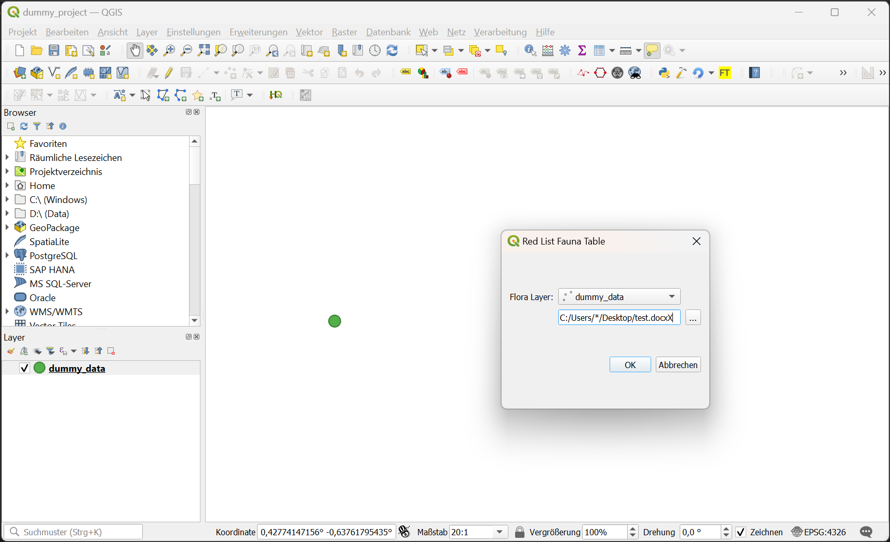
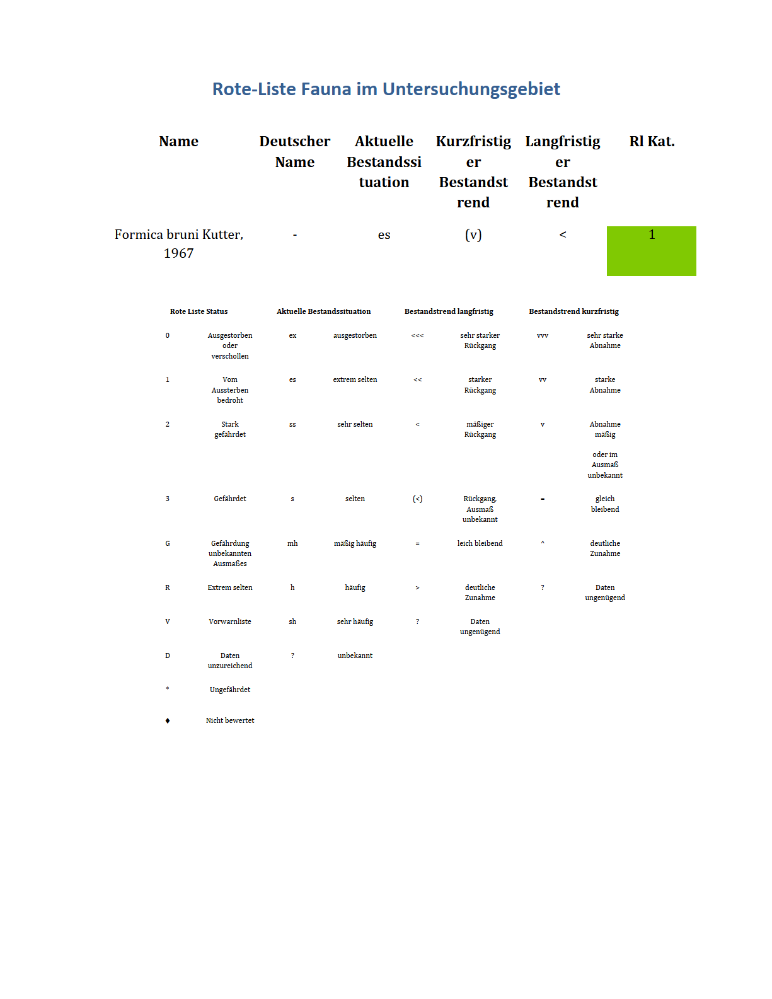

# flora_docx_table
QGis plugin that creates a .docx table of fauna with various information that are on the rote liste. Landscape planners usually do this by hand, which takes several hours. This plugin automizes the task, saving a lot of time.

# Installation
1. Download the .zip file
2. Copy the "red_list_fauna_table" folder to your QGis plugin directory (Settings -> User profiles -> Open active profile folder -> python -> plugins). 
3. Open the Osgeo-shell and run ``pip install python-docx``
4. Restart QGis.

## Usage
1. Open Plugin
2. Choose layer
3. Choose fauna field
4. Choose output path
5. Press Ok

## The Plugin

## The Output

