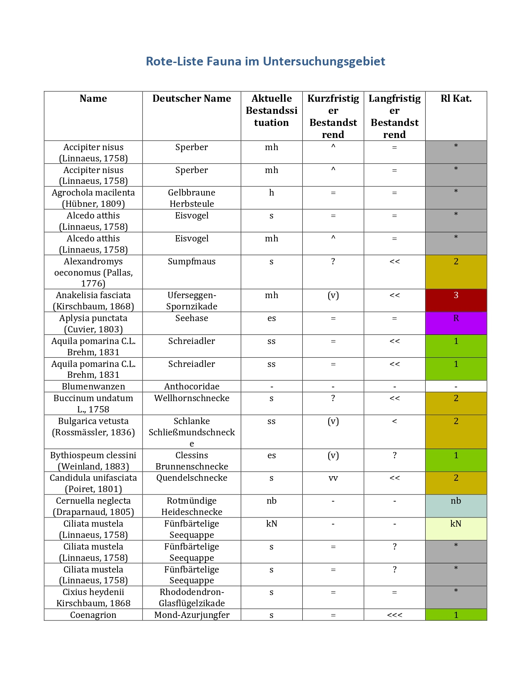
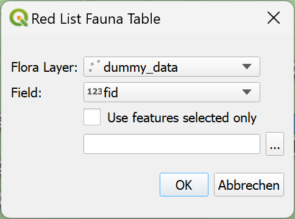

# A QGis Plugin for creating Word-tables about mapped fauna
## Introduction

Species conservation reports (SCR) are essential for environmental planning as they contribute significantly to biodiversity. They support protection by analyzing project impacts and recommend conservation measures. These reports are legally required, aid in early protective measure integration, and raise public awareness. They play a crucial role in analyzing the impact of planning and construction projects on various species and their habitats. They do this by analyzing potential threats in detail and recommending suitable conservation measures. In summary, the reports contribute to the sustainable design of projects.

SCRs are relevant in several ways. Firstly, they aid in the conservation of biodiversity by identifying endangered or protected species and their habitats. This allows for targeted consideration and minimisation of negative impacts on the species. Secondly, species conservation reports are often legally required to ensure compliance with nature conservation legislation. They play a crucial role in authorisation procedures and environmental impact assessments. The early integration of protective measures is an important aspect. By integrating species protection assessments into the early planning process, potential negative impacts can be avoided or minimized in the long run. This promotes sustainable development by incorporating the protection of species and habitats into the design of human activities. It is also important to have species protection expertise to provide certainty for planners and investors. Knowledge and compliance with the existing legal framework provide protection against legal conflicts and delays, promoting the smooth realization of projects. Additionally, expert opinions on species protection law can help raise public awareness of environmental issues by communicating the importance of species and nature conservation, creating an understanding of the interactions between human activities and nature. SCRs play a central role in environmental planning by creating a balance between human activities and the protection of nature. They are a key element of sustainable development and help to maintain ecological balances.

A QGIS plugin for automating table creation and data management while creating an SCR in environmental planning offers many different advantages. It ensures compliance with standards, allows for flexibility, and enhances data integrity and documentation. Integrating this plugin would streamline the process, improve efficiency, and enhance overall quality. Such a plugin can also be used as a base for similar use cases in the future.

A significant time efficiency is achieved by automating this part of the process. Users can access the plugin directly within the QGIS interface that generates the necessary data fields and structures. This is time-saving and promotes consistency and standardization. The plugin ensures that the tables created comply with the current requirements and standards for specialized species conservation reports. This not only improves the quality of the work but also minimizes the risk of errors that could arise from manual data entry. The user-friendliness of a QGIS plugin for creating tables is also an important factor. Environmental planners can work directly within their familiar QGIS interface without switching between different applications. This further enhances efficiency and simplifies the workflow. The mouldability of the plugin is important as specialist SCRs may have varying requirements and standards depending on the region. A well-designed plugin provides customizable options to meet different needs and enhances the flexibility. Automation also enhances data integrity. The plugin can enforce validation rules and data types to ensure that the created tables meet the required quality standards. This reduces the likelihood of input errors and enhances the reliability of the captured data. Overall, integrating a QGIS plugin for creating tables for species conservation reports could enhance efficiency, improve quality, and increase user-friendliness. Ultimately, automating this process would allow environmental planners to use their time more effectively while ensuring that the tables meet the required standards.

The aim of this project was to write a QGIS plugin to create fauna tables directly from a QGIS layer. The tables will contain information about the red list status of the animals in the layer. An example can be found on page 13 in this [paper](https://roedermark.de/fileadmin/Roedermark/FB6/Stadtplanung/A20.8/03-3_A20.8_Artenschutzrechtlicher_Fachbeitrag.pdf). 

The plugin will be able to minimize time spent creating the tables, which is usually done by hand over the course of several hours. Also, errors in the tables will be minimized. The tables can be used e.g. for species conservation reports.
 
 
## Methods

The operating software QGIS is an open-source geographic information system (GIS) that allows users to visualize, analyze and interpret spatial data. Due to its user-friendly interface and broad support of file formats, it is widely used in geographical analyzes as a versatile tool for research, cartography, and more. Its extensive set of plugins, which extend the usage of the base program itself, and the robust community support, make the software popular among GIS professionals. The software is also used by lots of companies, organizations and educational institutions. QGIS enables users to create visually appealing maps, perform spatial analysis, and integrate data from multiple sources to make informed decisions in a variety of fields, such as environmental science, urban planning, and natural resource management. QGIS bears the capability to be extended using user-written plugins, coded in Python ([QGis](https://qgis.org/en/site/index.html), [Python](https://www.python.org/). The plugin for this use-case was initially built with the QGIS plugin builder, a useful tool for creating custom plugins for specific functionality adaptations. The plugin builder streamlines tasks such as creating user interfaces and connecting it to the QGIS functionality, empowering developers to focus on the core logic of their plugins. 

The created plugin in this case simplifies the process of creating detailed tables from a selected map layer. It quickly identifies all species names on the map and combines them with data from its own database to generate a neatly organized table that includes essential columns such as 'Name' and 'Current Population Status.'  For clarity, a dash (-) indicates any missing information.

The table is formatted in a Word document, with a stylised header. The table dynamically highlights the column labeled 'RL Kat.' by colorization, to indicate species' protection statuses. This makes it easy to identify species that require attention. The Word document is well-structured, featuring a clear table of contents and distinct sections, which makes navigation effortless. The plugin features a color-supported legend to explain any symbols used in the table and allows for easy saving of the document to any location. 
This plugin simplifies the process of creating detailed wildlife tables, enhancing both their visual appeal and informational value. This tool is crucial for legal and conservation purposes. It facilitates ecological assessments and species protection efforts. The data of red list status was downloaded from [here](https://www.rote-liste-zentrum.de/de/Download-Wirbeltiere-1874.html).

## Results

The plugin creates a fauna table, see Figure X, as output as intended, and the plugin therefore works as designed. The created table includes the scientific name as well as the common name in German language. Next the current population situation next to the short-term and the long-term population trend. Lastly and most importantly the red-list status or endangerment status is given. Additionally, a legend with all relevant information is situated on the last page of the document. For easier recognition the different red-list status information is colored, so the most important information is easily visible.

For the completion of this small research project, the creation of the plugin was successful. After some productive testing, the output table was optimized, and minor inconveniences were eliminated in the process.

If the requirements for the results should change, the plugin can be adapted at any time. Since the source code is publicly available through a GitHub-Repository, anyone can access the code, download a copy and adapt it as needed.

 
## Conclusion

This blogpost reports the creation and the benefits of a QGIS plugin for the creation of word tables specifically for the endangerment status of fauna. The plugin code was written in Python and successfully implemented into QGIS and works as intended. The plugin can now be used to create tables for the use case. Once created, it saves a lot of time every time the different data is processed. Also, the risk of errors that could arise through manual processing is lowered significantly. Subsequently, the tables are created standardized and therefore easy to read and understand. Next to this the legend stays the same for all created tables. Yet, the coding until the plugin works as intended can be tedious and time consuming. But through the code based plugin its functionality is easily accessible and outputs customizable.  

The whole workflow also gets optimized using the plugin. Now the whole analysis takes place in the already widely used QGIS interface and the software doesn't need to be switched. 

With little knowledge in coding the plugin can be adapted for different or special needs, making it a multi-purpose base for similar use cases. Hence, in the long run the creation of a plugin to optimize the desired, repeating workflow is beneficial for users. 
